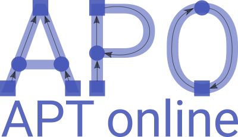
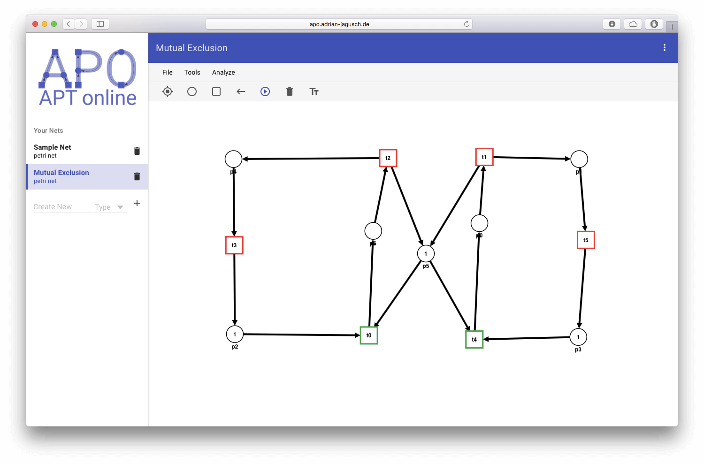
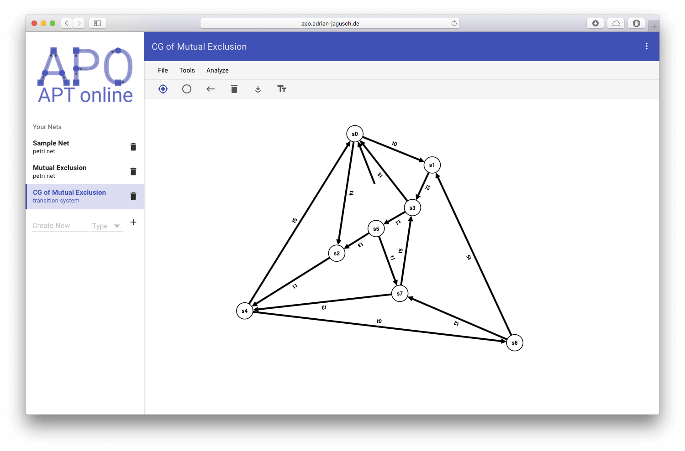
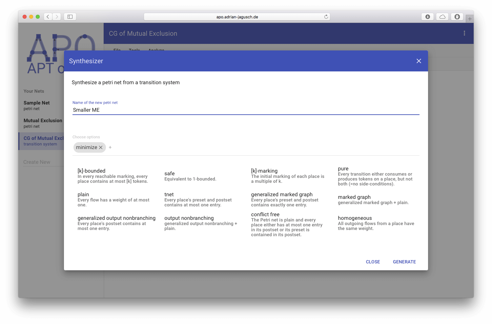
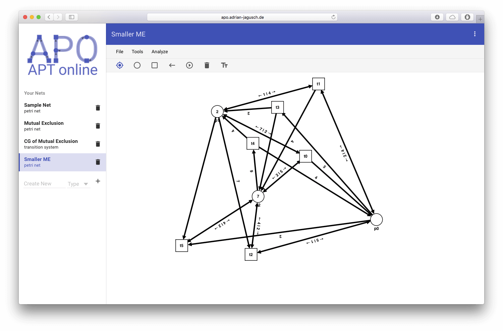

# APO – APT Online [](https://travis-ci.org/stromhalm/apo)


APO is a web interface for [APT](http://github.com/cvo-theory/apt), a powerful software for petri net analysis and synthesis developed at the Carl von Ossietzly University in Oldenburg, Germany. Visit [apo.adrian-jagusch.de](http://apo.adrian-jagusch.de) in your browser to try it out!

## Quickstart
APO currently supports two types of nets: **[Petri nets](https://en.wikipedia.org/wiki/Petri_net)** (PN) and **[(labeled) transition systems](https://en.wikipedia.org/wiki/Transition_system)** (LTS). At your first visit a sample Petri net is created for you. Use the tools in the toolbar to create places and transitions and combine them with the **Arrows** tool.

Then let APO calculate the properties of your net by using the Petri net analyzer in the menu bar! Is your net safe or bounded? What abour its reversibility?

### Short guide for using APO
Now let's use APO to mimimize a Petri net! First we create a net for mutual exclusion which is an often used example for the parallel features of Petri nets. See the first image below for what such a net could look like. You may use the **Tokens** tool to fire transitions and elucidate the nets behavior.

Then use the **Coverability Graph** module to generate the nets coverability graph. It will be created as a new transition system. Use the **Fix Nodes** tool to unravel the nodes.

Now let's synthesize an Petri net from this transition system which will have the same behavior but needs less nodes. Use APOs **Synthesizer** module and choose **minimize** as an option. Notice all the other options for net synthesis – you may combine them as you like.

Image 4 shows the result which has been created as a new Petri net in the sidebar. It has the same behavior as the often referenced example for mutual exclusion but due to its intelligent use of weighted edges it only has 9 nodes (instead of 13 in the old net).






## Development

APO is written in the [CoffeeScipt](http://coffeescript.org/) programming language. It is maintained by [Adrian Jagusch](https://adrian-jagusch.de) and was part of his bachelor thesis. 

### Installing
Before running, you must install and configure the following one-time dependencies:

* [Git](http://git-scm.com/)
* [Node.js](http://nodejs.org/)
* [Grunt](http://gruntjs.com/) - use the terminal command below
```bash
$ npm install -g grunt-cli
```
* [karma](https://github.com/karma-runner/karma) - For Windows machines, you may need to install [karma](https://github.com/karma-runner/karma) globally.  Use the terminal command below
```bash
$ npm install -g karma
```

Once the dependencies have been installed, enter the following commands in the terminal:
```bash
$ git clone https://github.com/stromhalm/apo.git
$ cd apo
$ npm install
```

### Development
Development with APO is simple. Just type
```bash
$ grunt
```
to compile all the CoffeeScipt files and start a local server running APO on your machine. Your default browser is opened automatically and Grunt will watch for file changes and refresh your browser.

For production environments there is a second compiling option. Grunt will compress HTML, JavaScript, CSS and images, concatenate them and add offline support to the web app. Just run `grunt prod` and you can find the compiled output in the `dist` folder. All your other files will remain unchanged.

APO uses several frameworks and libraries:
* [CoffeeScipt](http://coffeescript.org) – A beautiful programming language for the web
* [AngularJS](http://angularjs.org) – For a modern and dynamic MVC web application
* [D3.js](http://d3js.org) – For the physics simulation in your browser
* [Angular Material](http://material.angularjs.org) – For beautiful design components based on Googles [Material Design](https://material.google.com)
* [ngClassify](https://github.com/CaryLandholt/ng-classify) – A set of AngularJS classes in CoffeeScript
* [Less](http://lesscss.org) – For nice CSS code with variables and inheritance.
* [GitHub](http://github.com) – Here you are ;-)
* [Travis CI](http://travis-ci.org) – For testing and continuous deployment
* [Angular APT](https://github.com/stromhalm/angular-apt) – The APT interface for web applications
* [CoffeeLint](http://coffeelint.org) – For linting CoffeeScipt
* [Jasmine](http://jasmine.github.io) – A JavaScript testing framework
* [Karma](http://karma-runner.github.io) – A JavaScript test runner with AngularJS in mind
* [AngularFun](https://github.com/CaryLandholt/AngularFun) – A good starting point for modern web development

### Contribute
If you find a bug in the source code or a mistake in the documentation, you can help by submitting an [issue](https://github.com/stromhalm/apo/issues) to the repository.  Even better, you can submit a [Pull Request](#pull-requests) with a fix.

Enhancements like new net types or analysis modules are always welcome! Feel free to cantact me :)
